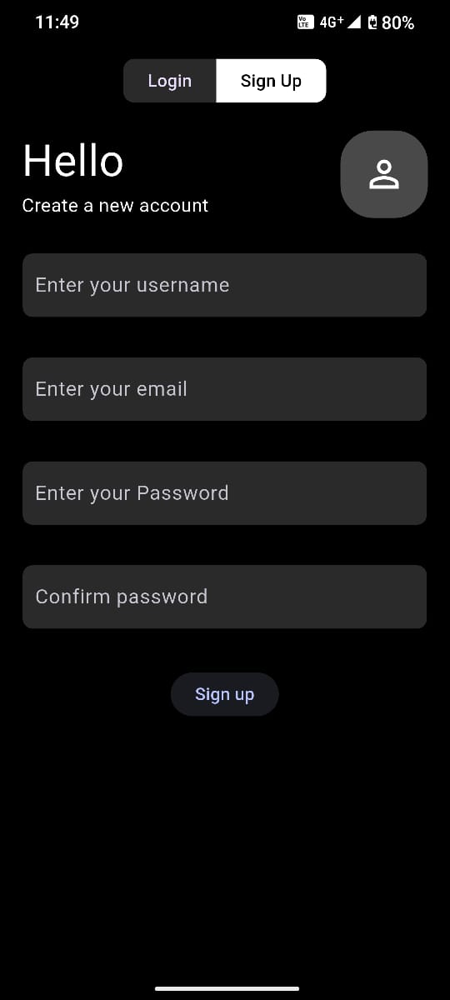
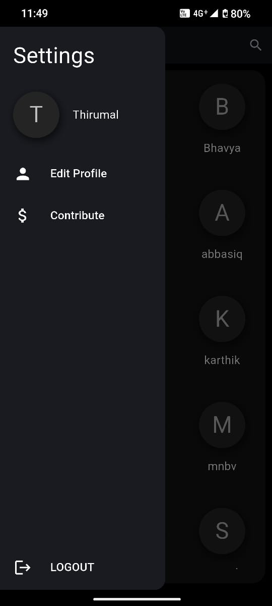
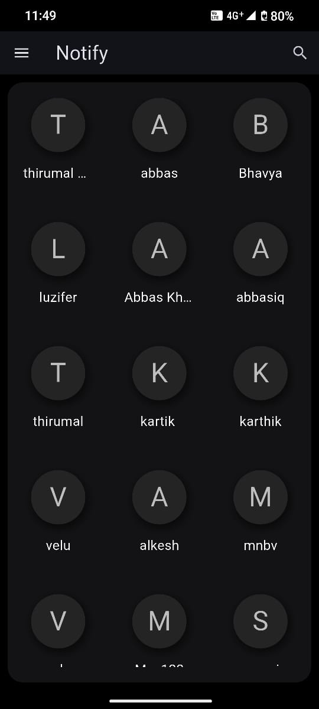
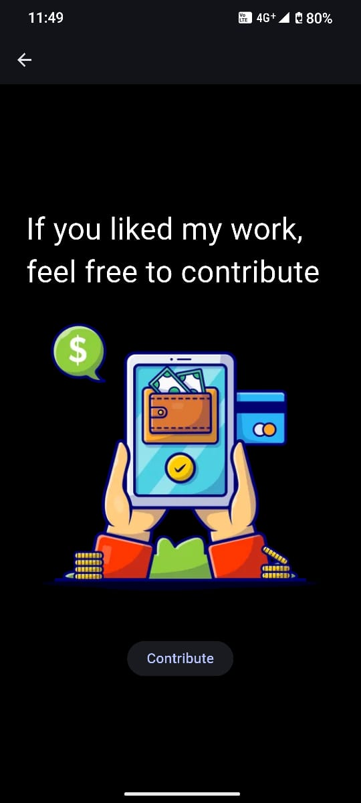
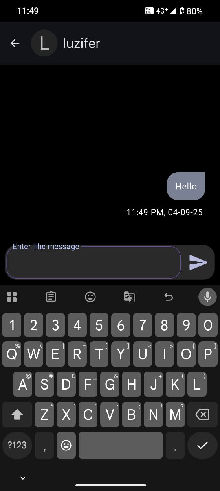

# 🔔 Notify – Chat Application  

Notify is a **real-time chat application** built with **Flutter** and powered by **Firebase** as the backend database.  
It allows users to seamlessly communicate with each other with instant message delivery and a clean, user-friendly interface.  

---

## ✨ Features
- 🔑 **User Authentication** (via Firebase Auth)  
- 💬 **Real-time Messaging** using Firebase Firestore  
- 📱 **Cross-Platform** (Android & iOS with Flutter)  


---

## 📲 Download APK  
👉 [Download Notify APK](https://github.com/123thirumal/Notify/releases/download/v1.0.0/app-release.apk)  


---

## 🖼️ Screenshots  

|             |             |              |
|-------------|-------------|--------------|
|  |  |  |

|                 |                |                |
|-----------------|----------------|----------------|
|  |  |  |


---

## 🛠️ Tech Stack
- **Frontend:** Flutter (Dart)  
- **Backend & Database:** Firebase (Firestore, Auth)  

---

## ⚙️ Firebase Configuration (Important for Cloning)
If you clone this project, you need to **set up your own Firebase project** and add the following files:  

1. `lib/firebase_options.dart` → Generated using the **FlutterFire CLI**.  
2. `android/app/google-services.json` → Download from Firebase Console (for Android).  
3. `ios/Runner/GoogleService-Info.plist` → Download from Firebase Console (for iOS).  
4. `firebase.json` → (optional) Required if using Firebase Hosting or Functions.  

📌 Without these files, the project will **not run** because Firebase credentials are missing.  
Follow the official [FlutterFire documentation](https://firebase.flutter.dev/docs/overview/) for setup.  

---

## 🚀 Getting Started (For Developers)
1. Clone this repository  
   ```bash
   git clone https://github.com/your-username/notify.git
